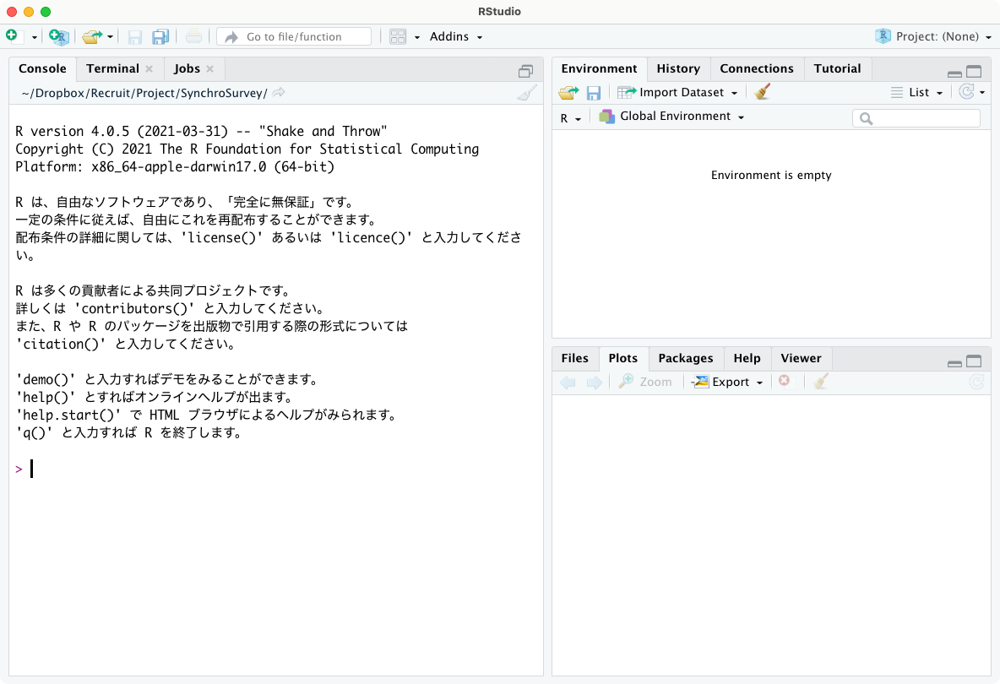

# RとRStudioの下準備 {#preparation}

## RとRStudioのインストール方法

[矢内勇生先生のページ](https://yukiyanai.github.io/jp/resources/)を参照して、RおよびRStudioをインストールしてください。

-   Macの人は38ページまで、Windowsの人は102ページまでやれば準備完了です。「RStudioのカスタマRStudioのカスタマイズ」（Macの人は39ページ以降、Windowsの人は103ページ以降）は、個人的にはやらなくても大丈夫だとおもいます（好みの問題です）。

-   Windowsの人向け：p.27--35の「対処法その3」は（よっぽどパソコンに詳しい人でない限り）危険な操作なのでおすすめしません

-   基本的には上記の資料のとおりにやればうまくいくと思いますが、何やらエラーが出る場合には[2020年の別の授業経験をもとに書いた以下の記事](http://ryotamugiyama.com/2020/08/03/rinstall/)が参考になるかもしれません。

## データ分析のワークフロー

データ分析のワークフローをおおまかに示すと、次のようなものになる。

1.  プロジェクトフォルダを作成する（この章で解説）

2.  データを取得する（→[データの読み込み](#import)）

3.  データを開く（→[データの読み込み](#import)）

4.  データを加工する（→[データの加工](#handling)）

    1.  変数の作成

    2.  サンプルの限定

    3.  加工したデータの保存

5.  データを分析する

    1.  基礎集計（→[1変量の集計](#descriptives)）

    2.  2変量の関連分析（→[2変量の集計](#tabulate)、[回帰分析の基礎](#regression_basic)）

    3.  他の要因を統制した分析（→[回帰分析の活用](#regression_advanced)、[ロジスティック回帰分析](#logit)）

6.  分析結果を出力する

7.  誤りや改善点、アイデアを見つけ、再度データを加工する（4に戻る、4から6をn回繰り返す）

8.  最終的な分析結果を論文にまとめる

出版された論文を読むと、あたかもエレガントな分析結果がはじめからスムーズに提示されているような印象を受ける。しかしながら実際にはそのように分析がスムーズに進むことはない。舞台裏では（必ずしもきれいとはいえない）データを加工し、分析し、間違いをみつけては再度データを加工して分析し、他の人からコメントをもらったりして再度データを加工したり分析して......といったふうに何度もPDCAが行われている。なので、データ分析の過程で行きつ戻りつすることはむしろふつうのことだと思ったほうがよい。

PDCAの過程では、「[研究計画を立てる](#plan)」で作成したような研究計画を修正したりすることがある。それ自体は必ずしも悪いことではない。しかし、計画なしに手当たり次第に分析してしまっては、自分が何をやっているのかわからなくなってしまう。自分が何をしたいのか、自分が今何をしているのか（上記のどの段階にいるのか）を意識しながら、データを加工したり分析したりすることが重要になる。

## プロジェクトの作成

### ファイルパスについて

ところで、

### 授業用のフォルダを作ろう

この授業のために使う資料やコードなどをまとめておくためのフォルダを作っておくとよい。適宜、自分のわかりやすい箇所を選ぶとよい。

-   Windowsの場合：「OneDrive」→「ドキュメント」の下などに作成すると、自動でバックアップを取ってくれるのでおすすめ。

-   Macの場合：「iCloud Drive」→「書類」の下などがおすすめ。

いずれも、Cloudの容量の上限に達しているとエラーが出るので注意。写真や動画ファイルなどは容量が大きいのでCloudの容量を拡張したり別のサービスを使って、そちらに移しておくとよい。

### プロジェクト作成の手順

データの読み込みや保存をするときには、コンピュータにその起点となる場所（ディレクトリ）を決めておくと便利である。

RStudioで「プロジェクト」を作成することで、その場所が作業ディレクトリだということをRに教えてあげることができる。

新たな研究をはじめるときには、必ずプロジェクトを作成する。

作業を再開するときには、プロジェクトを開く。

1.  "File" > "New Project"、または右上の"Project" > "New Project"
2.  "New Directory"を選択
3.  "New Project"を選択
4.  Directory nameに作業ディレクトリの名前をつけ（ここでは「practice」とします）新しいフォルダを作る場所（先ほどのゼミ用フォルダ）を指定
5.  指定した場所 "practice.Rproj"というファイルが入ったフォルダができる
6.  右上の表示が「Project: None」から「practice」に変わっていれば成功！

## 基本的な見方

### ちょっとさわってみる



特に設定を変えていないならば、はじめてRStudioを開くと次のような画面になっている。それぞれ以下のように対応している。

-   左のウインドウ：コマンドを入力して、結果が出力されるウインドウ

-   右上のウインドウ：読み込まれているオブジェクトを表示するウインドウ

-   右下のウインドウ：ファイルの一覧をみたり、グラフが表示されたり、ヘルプファイルを表示されたりするウインドウ

左のウインドウに以下のコードを書いて、実行（Enter）を押してみよう：

```{r}
1 + 2
```

すると、計算結果が表示される。

### スクリプトファイル

実際には上記のような1行ですむコードを書くわけではもちろんなく、色々とコードを書いて、データを加工したり分析をしたりしていく。そうなってくると、コードはコードとしてまとめて書くことのできる場所があると嬉しいだろう。このような用途で使うのが、スクリプトファイルである。以下の手順で新規のスクリプトファイルを開くことができる。

1.  左上の白い四角にプラス（+）マークのついたアイコンをクリック
2.  「R script」を選択

すると、RStudioの左上に次のような場所が現れる：


この左上のスクリプトファイルにコードを書き、実行したい行にカーソルを合わせて、スクリプト右上の「Run」をクリックすると、命令が実行され、結果が左下のConsoleに出力される。実行したい箇所をドラッグした状態で実行すれば、複数の命令をまとめて実行することもできる。

「Run」は頻繁に使うので、毎回クリックするのは面倒なので、ショートカットキーを覚えよう。実行には以下のショートカットキーを使う。

-   Windows: ctrl + enter

-   Mac: command + enter

以下のコードを実行してみよう：

```{r}
1 + 2

8 - 3

10 * 8

4 / 15
```

## パッケージのインストール

`install.packages()`はゲームソフトを購入（無料ですが）するようなもの。実際にそのソフトに入っているコンテンツを使うためには、ソフトをセットしないといけない。その際には、`library()`を用いる。

本資料では以下のパッケージを使用する。今まとめてインストールしておくと楽かと思います。

```{r, eval = FALSE}
install.packages("tidyverse")
install.packages("haven")
install.packages("readxl")
install.packages("gtsummary")
install.packages("dagitty")
install.packages("ggdag")
install.packages("estimatr")
install.packages("modelsummary")
install.packages("labelled")
install.packages("flextable")
install.packages("broom")
```

とくに重要なのが`tidyverse`パッケージ。以下の8つのパッケージをまとめたパッケージ群であり、どれもよく使うものなので、何らかの分析をする際にはほとんど常に`library("tidyverse")`を実行しておくのがよい。

-   ggplot2
-   tibble
-   tidyr
-   readr
-   purrr
-   dplyr
-   stringr
-   forcats

インストールがすんだら、次のコマンドで`tidyverse` パッケージを利用可能な状態にしてみよう：

```{r}
library(tidyverse)
```

## データ読み込み以前のRの基礎

これについてはたくさんの素晴らしい解説があふれているのでここでは扱わない。いくつかリストアップしておく。

-   浅野正彦・矢内勇生，2018，『Rによる計量政治学』オーム社より「4.2　Rの基本操作」.

-   Imai, Kosuke. 2018. Quantitative Social Science: An Introduction.Princeton University Press. （粕谷祐子・原田勝孝・久保浩樹訳，『社会科学のためのデータ分析入門』岩波書店．）「1.3　Rの基礎」
