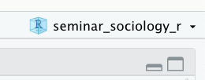

# RとRStudioの下準備 {#preparation}

## RとRStudioのインストール方法

[矢内勇生先生のページ](https://yukiyanai.github.io/jp/resources/)を参照して、RおよびRStudioをインストールしてください。体感では、お使いのPCの環境的な問題によりインストールでつまづく人が10人に1--2人くらいの割合でいるので、つまづくのはよくあることです。なので、つまづいたら教員に質問しましょう。

-   Macの人は38ページまで、Windowsの人は102ページまでやれば準備完了です。
    -   MacとWindowsの人どちらも：「RStudioのカスタマイズ」（Macの人は39ページ以降、Windowsの人は103ページ以降）は、やらなくても問題ありません。
    -   Windowsの人向け：p.27--35の「対処法その3」は（よっぽどパソコンに詳しい人でない限り）危険な操作なのでおすすめしません。
    -   Windowsの人向け：p.58--66の「プログラミング用フォントのインストール」は飛ばしても問題ありません。
-   基本的には上記の資料のとおりにやればうまくいくと思いますが、何やらエラーが出る場合には[2020年の別の授業経験をもとに書いた以下の記事](http://ryotamugiyama.com/2020/08/03/rinstall/)が参考になるかもしれません。


## データ分析のワークフロー

データ分析のワークフローをおおまかに示すと、次のようなものになる。

1.  プロジェクトフォルダを作成する（この章で解説）

2.  データを取得する（→[データの読み込み](#import)）

3.  データを開く（→[データの読み込み](#import)）

4.  データを加工する（→[データの加工](#handling)）

    1.  変数の作成

    2.  サンプルの限定

    3.  加工したデータの保存

5.  データを分析する

    1.  基礎集計（→[1変量の集計](#descriptives)）

    2.  2変量の関連分析（→[2変量の集計](#tabulate)、[回帰分析の基礎](#regression_basic)）

    3.  他の要因を統制した分析（→[回帰分析の活用](#regression_advanced)）

6.  分析結果を出力する

7.  誤りや改善点、アイデアを見つけ、再度データを加工する（4に戻る、4から7をn回繰り返す）

8.  最終的な分析結果を論文にまとめる

出版された論文を読むと、エレガントな分析結果がはじめからスムーズに提示されているような印象を受けるかもしれない。しかしながら、実際はそのようにスムーズに分析が進むことはない。舞台裏では（必ずしもきれいとはいえない）データを加工し、分析し、間違いをみつけては再度データを加工して分析し、他の人からコメントをもらったりして再度データを加工したり分析して......といったふうに何度もPDCAが行われている。なので、データ分析の過程で行きつ戻りつすることはむしろふつうのことだと思ったほうがよい。

PDCAの過程では、「[研究計画を立てる](#plan)」で作成したような研究計画を修正したりすることがある。それ自体は必ずしも悪いことではない。しかし、計画なしに手当たり次第に分析してしまっては、自分が何をやっているのかわからなくなってしまう。自分が何をしたいのか、自分が今何をしているのか（上記のどの段階にいるのか）を意識しながら、データを加工したり分析したりすることが重要になる。

## プロジェクトの作成 {#preparation_project}

### RStudioを開いてみよう


特に設定を変えていないならば、はじめてRStudioを開くと次のような画面になっている。それぞれ以下のように対応している。

-   左のウインドウ：コマンドを入力して、結果が出力されるウインドウ

-   右上のウインドウ：読み込まれているオブジェクトを表示するウインドウ

-   右下のウインドウ：ファイルの一覧をみたり、グラフが表示されたり、ヘルプファイルを表示されたりするウインドウ

### 授業用のフォルダを作ろう

この授業のために使う資料やコードなどをまとめておくためのフォルダを作っておくとよい。適宜、自分のわかりやすい箇所を選ぶとよい。

-   Windowsの場合：「OneDrive」→「ドキュメント」の下などに作成すると、自動でバックアップを取ってくれるのでおすすめ。

-   Macの場合：「iCloud Drive」→「書類」の下などがおすすめ。

いずれも、Cloudの容量の上限に達しているとエラーが出るので注意。写真や動画ファイルなどは容量が大きいのでCloudの容量を拡張したり別のサービスを使って、そちらに移しておくとよい。

### ファイルパスと作業ディレクトリ

コンピュータ上のさまざまなファイルを置いた場所を指してフォルダ、あるいはディレクトリという。コンピュータ上のファイルは基本的にフォルダの中に入れて管理する。

このフォルダにはそれぞれ住所がついている。この住所を指して、ファイルパス、またはたんにパスという。たとえば自分がこの資料を作成しているフォルダのファイルパスは、"User/mugi/...（中略）.../seminar_sociology_r"である。

ファイルパスというのが何かをつかむため、現実世界の住所について考えてみよう。たとえば、学習院大学目白キャンパスの住所は「東京都豊島区目白1-5-1」である。この住所は、前から順番に読んでいって、より小さい単位を指す（東京都のなかにある豊島区、豊島区のなかにある目白、目白のなかにある1丁目......というふうに）。ファイルパスはまさにこの「東京都豊島区目白1-5-1」のような住所であり、フォルダのありかを示す役割を果たす。

RStudioが作業場所だと認識している場所を指して、作業ディレクトリという。この作業ディレクトリのファイルパスは、左下の画面の上部に記載されている。分析などを行う際には、このファイルパスが自分の意図している場所と一致しているかどうかを確認する必要がある。

### プロジェクト作成の手順

先ほど作成した授業用フォルダのなかに、データを置いたりコードを置いたりするためのフォルダを作って、そこが作業ディレクトリだとRStudioに教えてあげたい。このようなときに便利な昨日が、「プロジェクト」である。この機能を利用することで、プロジェクトを作成した場所が作業ディレクトリであることをRに教えてあげることができる。新たな研究をはじめるときには、必ずプロジェクトを作成するようにする。

プロジェクトの新規作成手順は次のとおり。

1.  "File" \> "New Project"、または右上の"Project"の箱を選択 \> "New Project"
2.  "New Directory"を選択
3.  "New Project"を選択
4.  Directory nameに作業ディレクトリの名前をつけて（ここでは「seminar_sociology_r」とする）、"Browse"から新しいフォルダを作る場所（先ほどの授業用フォルダ）を選択
5.  指定した場所に、"seminar_sociology_r.Rproj"というファイルが入ったフォルダができる
6.  右上の表示が（まだ何もプロジェクトを開いていない場合には）「Project: None」から「seminar_sociology_r」に変わっていることを確認する。

すでに作成済みのフォルダを作業用フォルダとして指定したい場合には、次のような手順で行う。

1.  "File" \> "New Project"、または右上の"Project" \> "New Project"
2.  "Existing Directory"を選択
3.  "New Project"を選択
4.  "Browse"から作業用フォルダとして指定したいフォルダを選択
5.  右上の表示が（まだ何もプロジェクトを開いていない場合には）「Project: None」から作業用フォルダとして指定したフォルダの名前に変わっていることを確認する。





## 基本的な操作


プロジェクトが作成できたら、ためしに左のウインドウに以下のコードを書いて、Enterを押してみよう。計算結果が表示される。

```{r}
1 + 2
```

### スクリプトファイル

実際には上記のような1行ですむコードを書くわけではもちろんなく、色々とコードを書いて、データを加工したり分析をしたりしていく。そうなってくると、コードはコードとしてまとめて書くことのできる場所があると嬉しいだろう。このような用途で使うのが、スクリプトファイルである。以下の手順で新規のスクリプトファイルを開くことができる。

1.  左上の白い四角にプラス（+）マークのついたアイコンをクリック
2.  「R script」を選択

すると、RStudioの左上に次のような場所が現れる：


この左上のスクリプトファイルにコードを書き、実行したい行にカーソルを合わせて、スクリプト右上の「Run」をクリックすると、命令が実行され、結果が左下のConsoleに出力される。実行したい箇所をドラッグした状態で実行すれば、複数の命令をまとめて実行することもできる。

「Run」は頻繁に使う。毎回クリックするのは面倒なので、ショートカットキーを覚えよう。実行には以下のショートカットキーを使う。

-   Windows: ctrl + enter

-   Mac: command + enter

以下のコードを実行してみよう：

```{r}
1 + 2

8 - 3

10 * 8

4 / 15
```

### スクリプトファイルを保存する

上記のようにスクリプトを書いて実行していくわけだが、スクリプトを書いた変更が保存されていない状態だと、スクリプトの上部が赤く表示される。


このスクリプトを保存する場合には、上記のフロッピーディスク（今の大学生は見たことも聞いたこともないと思いますが......）のアイコンをクリックすると、変更を保存することができる。フロッピーディスクが1枚のアイコンは「上書き保存」、2枚重なったアイコンは「現在開いているスクリプトファイルをまとめてすべて保存」を表している。

スクリプトを保存すると、赤い文字列は黒い表示になり、無事保存されたことがわかる。保存したファイルは「xxxxx.R」というファイルとして、現在開いているプロジェクトフォルダに保存される。後日作業を再開するときには、再度当該ファイルを開けばよい。

### パッケージのインストール

`install.packages()`はゲームソフトを購入（無料ですが）するようなもの。実際にそのソフトに入っているコンテンツを使うためには、毎回RStudioを立ち上げるために、ゲームソフトをセットしないといけない。その際には、`library()`を用いる。

本資料では以下のパッケージを使用する。今のうちにまとめてインストールしておこう。

```{r, eval = FALSE}
install.packages("tidyverse")
install.packages("haven")
install.packages("readxl")
install.packages("gtsummary")
install.packages("modelsummary")
install.packages("flextable")
install.packages("estimatr")
install.packages("broom")
```

とくに重要なのが`tidyverse`パッケージ。以下の8つのパッケージをまとめたパッケージ群であり、どれもよく使うものなので、何らかの分析をする際にはほとんど常に`library(tidyverse)`を実行しておくことになる。

-   ggplot2
-   tibble
-   tidyr
-   readr
-   purrr
-   dplyr
-   stringr
-   forcats

## その他の設定

画面上部のTools \> Global Options をクリックして、以下の画面を開く。


真ん中あたりにある「Workspace」の下、「Restore .RData into workspace at startup」のチェックを外し（デフォルトではチェックが入っている）、「Save workspace to .RData on exit:」を「Never」に変更する（デフォルトではAskになっている）。


以上は、一度変更したらその後は変更する必要はない[^02-preparation-1]。

[^02-preparation-1]: この設定をしない場合、RStudioを閉じるたびにworkspaceを保存するかどうか尋ねられることになる。これは一見便利に見えるが、以前に読み込んだパッケージなどの情報が保存されてしまうため、意図せずして異なるパッケージどうしで関数名がバッティングしてしまい、エラーの原因となる（参考：[関数名の衝突を避ける（R）](https://keachmurakami.github.io/page/2018/06/29/%E9%96%A2%E6%95%B0%E5%90%8D%E3%81%AE%E8%A1%9D%E7%AA%81%E3%82%92%E9%81%BF%E3%81%91%E3%82%8B-r/)）。またこれは再現可能性の点でも悪手である。アプリケーションを閉じようとするときに「保存せずに消しますか？」と言われると、なんとなく保存したくなってしまうのが人情なので、先手を打ってそのように聞かれないように対策をしておいたほうがよい。

## Rの基礎（準備中）

これについてはたくさんの素晴らしい解説が世の中にあふれているのでここでは扱わない。一例として以下の箇所などを参照のこと。以下の箇所で扱われている程度の基礎的な知識を次章以降では前提とする。

-   浅野正彦・矢内勇生，2018，『Rによる計量政治学』オーム社より「4.2　Rの基本操作」.

-   安井翔太・株式会社ホクソエム，2020，『効果検証入門：正しい比較のための因果推論／計量経済学の基礎』技術評論社より「付録 RとRStudioの基礎」

-   Imai, Kosuke. 2018. Quantitative Social Science: An Introduction.Princeton University Press. （粕谷祐子・原田勝孝・久保浩樹訳，『社会科学のためのデータ分析入門』岩波書店．）より"1.3 Introduction to R"（「1.3　Rの基礎」）

-   太郎丸博，2021，「[データを読み込む前に知っておきたいRの基礎](http://tarohmaru.web.fc2.com/R/R_Introduction/RBasics.html)」（[太郎丸博先生の授業関連ページ](http://tarohmaru.web.fc2.com/class.html)→「R入門（2021年社会学実習 G科目）」にアップロードされている資料です）

### オブジェクト

### データフレーム

### 行（観察）と列（変数）
