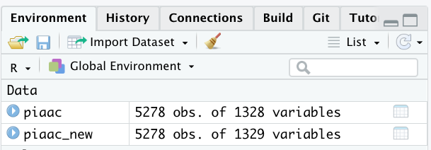

# データの加工 {#handling}

この章ではデータの加工方法について説明します。まずは以下のとおり`tidyverse`パッケージを読み込んでおきましょう。

```{r, eval = FALSE}
library(tidyverse)
```

## 本資料で用いるデータ

ここでの説明は以下の各章とも関係します。

この資料では基本的に、OECDが実施している国際成人力調査[Programme for the International Assessment of Adult Competencies, PIAAC](https://www.oecd.org/skills/piaac/)の日本版データをサンプルデータとして使用する。

```{r, eval = FALSE}
file_url <- "https://webfs.oecd.org/piaac/puf-data/CSV/prgjpnp1.csv"

download.file(url = file_url, destfile = "data/prgjpnp1.csv")
```

上記のコードだと、時間がかかってしまってダウンロードできないことがある。このような場合は、[Data](https://www.oecd.org/skills/piaac/data/)のページから"Download the datasets (Public Use Files)" \> "csv" \> "prgjpnp1.csv"を選択して、ファイルをダウンロードしよう。

ダウンロードしたら、データを読み込む。このデータは少し特殊で、数値のほかに文字列などが入っている。そのため、すこしだけ特殊な処理をほどこしてデータを読み込むことにする。

```{r}
piaac <- read_csv("data/prgjpnp1.csv") %>% 
  mutate_if(is.character, as.numeric) %>% #すべての文字列変数を小文字に変換
  rename_all(.funs = tolower) #すべての大文字を小文字に変換
```

通常、SSJDAなどの機関を通して社会調査データをダウンロードしたときに文字列が入っていることはまれなので、あまり心配しなくてよい。


## データ加工のステップ

いざデータを手に入れて読み込むことができたとしても、そこから分析に至るまでにはデータを加工して、分析の準備をしなくてはならない。このデータ加工は、大きく分けて以下の2つ（3つ）のステップからなる。

-   データの追加（該当者のみ）
-   変数の作成
-   サンプルの限定

データの加工を行う際には、今書いているコードがそれぞれ上記3つの作業のうちどの作業に該当するのかを混同しないように注意する。

### データの追加：複数のデータを合併し、行を追加する（該当者のみ）

たとえば複数の社会調査データを合併してサンプルサイズを増やしたり、時系列比較を行いたいといったことがあるかもしれない。このような場合には、データを追加する操作を行う。

以下のような2つのデータがあるとする。

```{r, echo = FALSE}
id <- 1:6
x1 <- c(5, 8, 2, 0, 6, 1)
x2 <- c(1, 1, 1, 2, 2, 2)
df1 <- tibble(id, x1, x2)
df1

id <- 7:10
x1 <- c(9, 4, 0, 2)
x2 <- c(2, 1, 2, 1)
df2 <- tibble(id, x1, x2)
df2
```

この2つのデータを合併して、次のようなデータを作る。

```{r, echo = FALSE}
df1 %>% 
  bind_rows(df2) %>% 
  mutate(data = if_else(id <= 6, "data 1", "data 2"))
```

今回の資料ではこのようなデータの追加については扱わない。

### 変数の作成：もとのデータに列を追加する

再度、一番はじめのデータに戻ろう。

```{r, echo = FALSE}
df1
```

「変数の作成」では、この元データを加工して、次のような**列**を追加するイメージ。

```{r, echo = FALSE}
df3 <- df1 %>% 
  mutate(x3 = x1 * 100) %>% 
  mutate(x4 = c("男性", "男性", "男性", "女性", "女性", "女性")) 
df3
```

### サンプルの限定：もとのデータから行を削除する

社会調査データを分析する場合、調査対象者をすべて分析対象に含めるわけではなく、年齢を限定したり、働いている人だけに限定したりといったふうに、分析対象を一部に限定することが多い。これは、先のデータから一部の人だけを選ぶ、つまり、行を削除するということに対応する。

```{r, echo = FALSE}
df3 %>% 
  filter(x3 >= 300)
```

## 変数の作成

### 変数の型（数値か、文字列か）

### 新たな変数をつくる：mutate()

データ操作の基本は、すでにある変数を書き換えたりして、自分の関心に即した新しい変数を作ることである。このときに使用するのが`mutate()`。変数の加工を行うときには、ほとんどの場合この`mutate()`を使うことになる。以下に、いくつか簡単な例を挙げる。

#### 例1: もとの変数の内容をそのままコピーする

PIAACには、ボーナスの額を含めて、対象者の給与を時給換算した`earnhrbonus`という変数が含まれている。この変数をそのままコピーして、時給換算した賃金を表す変数`wage`を作成する。

```{r, eval = FALSE}
piaac %>% 
  mutate(wage = earnhrbonus)
```

このコードは、「`piaac`というデータフレームに`wage`という列を追加してね、ちなみにその列には（既存の列である）`earnhrbonus`の値を入れてね」という命令を表している。

ただしこれだけだと新たに列を追加した結果だけが表示されて、データフレームそのものは更新されることはない。そこで、次のようにして、列を追加した結果を新たなデータフレームに格納してみる。

```{r}
piaac_new <- piaac %>% 
  mutate(wage = earnhrbonus)
```

すると、右側のEnvironmentのウインドウに新たに「piaac_new」というデータフレームが追加される。



`piaac_new` というのが、新たに1つ列を追加したデータフレームである。

もしくは、次のように同じデータフレームに格納してもよい。

```{r}
piaac <- piaac %>% 
  mutate(wage = earnhrbonus)
```

先ほど`piaac_new` というデータフレームに格納したのが「名前をつけて保存」に当たるとしたら、これは「上書き保存」に当たるようなイメージである。どちらでも、個人の好みに応じて使い分けるとよいだろう。

さて、上記の処理を行った結果、`piaac`というデータフレームには、`earnhrbonus`とまったく同じ値が含まれる`wage`という列が作られたことがわかる。

```{r}
piaac %>% 
  select(earnhrbonus, wage) %>% # select()についてはこのあと解説があります
  head()
```

もとの変数を何ら加工せずにそのまま使うとしても、元々の変数の名前がわかりやすいとはいえない名前になっていることはよくある（たとえば、`q31_3`、など）。このような場合には、今行ったように、その列が何の変数であるかがすぐに分かるように新たに名前を付けた列を作成すると、後から間違いが少なくなる。

#### 例2: もとの変数に何らかの計算を施す

たとえば、1週間の労働時間を尋ねた変数`d_q10`を5で割って、平日1日あたりの労働時間に変換した列を作りたいというときがあるだろう。このような場合には次のように計算する。

```{r}
piaac <- piaac %>% 
  mutate(workhour = d_q10 / 5)
```

新しく作った列`workhour`は、たしかにもともとの変数を5で割った値になっていることがわかる。

```{r}
piaac %>% 
  select(d_q10, workhour) %>% 
  head()
```

調査時点での就業状態（働いているか否か）を尋ねた項目`c_q01a`では、働いていれば1、そうでなければ2という値が入っている。これを変換して、働いていれば1、そうでなければ0となるような変数`work`を作ってみよう。

```{r}
piaac <- piaac %>% 
  mutate(work = 2 - c_q01a)
```

新しく作った列`work`は、確かにもともとの変数の値が1であれば1、2であれば0となっていることがわかる。

```{r}
piaac %>% 
  select(c_q01a, work) %>% 
  head()
```

#### 例3: もとの変数と関係なく、まったく新しい変数を作成する

たとえば、以下のように1ずつ増える変数を作成することもできる。この変数を分析に直接使用するということはないが、通し番号が振ってあると何かと便利なことが多い。

```{r}
piaac <- piaac %>% 
  mutate(id = 1:n())
```

`n()` はデータフレーム内の行数を返す関数。上記3つの例で作成した変数を並べてみよう：

```{r}
piaac %>% 
  select(id, wage, workhour) %>% 
  head()
```

### 条件の指定：if_else()

実際に`mutate()`で既存の変数の値を書き換えたりする場合には、カテゴリをまとめたり、複数の変数を組み合わせて新しい変数を作成したりすることが多い。そこでよく使う関数が`if_else()`、`case_when()`、`factor()`の3つである。

#### if_else()の説明

`if_else()`は、条件を指定し、その条件に合う場合と合わない場合の値を返す関数。`if_else(条件, 条件に合う場合の値, 条件に合わない場合の値)`、というふうに使う。

```{r}
piaac <- piaac %>% 
  mutate(gender = if_else(gender_r == 1, "男性", "女性"))
```

上記は、`gender`という列に対して、`gender_r`の列の値が1ならば"男性"、そうでないならば"女性"という文字列を入れてね、という命令である。

新しく変数を作ったときには、きちんとできているかどうかを逐一確認するのがよい。たとえば以下のように、古い変数と新しい変数の[クロス集計表](#tabulate)を作ってみるのが良い方法だろう。

```{r}
piaac %>% 
  with(table(gender_r, gender))
```

#### 論理演算子の説明

上記の例のように、条件を指定するときには論理演算子というのを使用する。よく使う論理演算子の意味は次の通り。

+------------+------------+-------------------------+--------------------------------------+
| 条件記号   | 意味       | コード例                | コード例の意味                       |
+============+============+=========================+======================================+
| `==`       | 等しい     | `age == 25`             | 年齢が25に等しい                     |
+------------+------------+-------------------------+--------------------------------------+
| `!=`       | ではない   | `age != 25`             | 年齢が25ではない                     |
+------------+------------+-------------------------+--------------------------------------+
| `>`        | より大きい | `age > 25`              | 年齢が25より大きい                   |
+------------+------------+-------------------------+--------------------------------------+
| `<`        | より小さい | `age < 25`              | 年齢が25より小さい                   |
+------------+------------+-------------------------+--------------------------------------+
| `>=`       | 以上       | `age >= 25`             | 年齢が25以上（25を含む）             |
+------------+------------+-------------------------+--------------------------------------+
| `<=`       | 以下       | `age <= 25`             | 年齢が25以下（25を含む）             |
+------------+------------+-------------------------+--------------------------------------+
| `&`        | かつ       | `age >= 25 & age <= 54` | 年齢が25以上54以下                   |
+------------+------------+-------------------------+--------------------------------------+
| `|`        | または     | `age < 35 | age > 54`   | 年齢が35より小さいまたは54より大きい |
+------------+------------+-------------------------+--------------------------------------+

以上、以下のときの不等号の位置（どちらも左側！）、等しいときには=ではなく==、などは間違えやすいので注意しよう。

### 複数条件の指定：case_when()

`if_else()`の場合は条件節は一つだが、複数の条件を指定して、それぞれの条件に対応するときに特定の値を入れたい、というような時がある。このときには、複数条件を指定して値を書き換えるコマンドである、`case_when()`をつかうとよい。

```{r}
piaac <- piaac %>% 
  mutate(agegroup = case_when(
    25 <= age_r & age_r <= 34 ~ "25-34歳",
    35 <= age_r & age_r <= 44 ~ "35-44歳",
    45 <= age_r & age_r <= 54 ~ "45-54歳",
    55 <= age_r & age_r <= 64 ~ "55-64歳"
    ))
```

ちゃんとできたかを確認しよう。

```{r}
piaac %>% 
  with(table(age_r, agegroup))
```

もともとのデータには年齢が16歳から65歳の人が含まれているが、先ほどのコードでは16歳から24歳、65歳の人が条件に含まれていなかったので、新しく作成した列である`agegroup`には該当するものがないという結果になっている。このようなケースには`NA`が与えられる。

実際、`NA`が与えられているかどうかを確認してみよう。以下のように`with(table())`にオプション`useNA = "always"`を指定することで、`NA`についても集計することができる。

```{r}
piaac %>% 
  with(table(age_r, agegroup, useNA = "always"))
```

### カテゴリ変数へ変換：factor()

PIAACには次のように、母親の最終学歴を尋ねた質問項目（j_q06b）がある。

| 選択肢                                 | 調査票の番号 |
|----------------------------------------|--------------|
| 小学校・中学校                         | 1            |
| 高校（旧制の中学校、高校を含む）       | 2            |
| 専門学校、高等専門学校、短大、大学以上 | 3            |

```{r}
piaac %>% with(table(j_q06b))
```

この数値だけでは、何番が何を指しているのかよくわからない。そこで、この変数の値にそれぞれ名前を付けて文字列（カテゴリ）変数とした変数`mothereduc`を作成する。

```{r}
piaac <- piaac %>% 
  mutate(mothereduc = factor(j_q06b,
                              levels = 1:3,
                              labels = c("母親・初等教育", "母親・中等教育", "母親・高等教育")))
```

結果を確認：

```{r}
piaac %>% with(table(j_q06b, mothereduc))
```

`if_else()`や`case_when()`を使って新しくカテゴリ変数を作るとき、カテゴリの順序が意図していたものとは違う順序になってしまうことがある。これは、文字列の場合はアルファベット順、日本語の場合はshift-jis順で並んでしまうことによる。

たとえば、1週間の労働時間（`d_q10`）に関する変数をもとに、労働時間の長さ別に分けたカテゴリ変数を作成したいと思ったとする。`case_when()` を使って作成すると、意図していた順序とは違ったバラバラの順番になってしまう。

```{r}
piaac <- piaac %>% 
  mutate(workhour_fct = case_when(
    d_q10 < 35 ~ "短時間（35時間未満）",
    d_q10 >= 35 & d_q10 <= 49 ~ "通常（35-49時間）",
    d_q10 >= 50 & d_q10 <= 59 ~ "準長時間（50-59時間）",
    d_q10 >= 60 ~ "長時間（60時間以上）"
  ))

piaac %>% with(table(workhour_fct))
```

このような場合には、いったん数値の変数を挟んでから`factor()` を使って変数を作成することで、順番がばらばらになってしまうのを防ぐことができる。

```{r}
piaac <- piaac %>% 
  mutate(workhour_fct = case_when(
    d_q10 < 35 ~ 1,
    d_q10 >= 35 & d_q10 <= 49 ~ 2,
    d_q10 >= 50 & d_q10 <= 59 ~ 3,
    d_q10 >= 60 ~ 4
  )) %>% 
  mutate(workhour_fct = factor(workhour_fct,
                               levels = 1:4,
                               labels = c("短時間（35時間未満）", "通常（35-49時間）", "準長時間（50-59時間）", "長時間（60時間以上）")))

piaac %>% with(table(workhour_fct)) 
```

### 必要な列のみ抽出：select()

このコマンドは「変数の作成」の節で扱ったコマンドと比べるとやや特殊で、列を追加するのではなく、列を**削除する**という操作を行う。普通に分析をする限りは列を削除する必要はないが、一部の列だけを取り出してどのようになっているのかを確認したりしたいときなどに使う。

このときに使うコマンドが`select()`である。

```{r}
piaac_sub <- piaac %>% 
  select(gender, wage) #gender, wageの列を抽出
```

```{r}
piaac_sub <- piaac %>% 
  select(-gender, -wage) #gender, wage「以外」の列を抽出
```

### %>%をつなげてコマンドをまとめる

変数を作成する過程では、正しく変数を作れているかどうかを一つひとつ確認しながら進めていくことが必須である。しかし、正しく作成できたことが確認できたら、`with(table())`などを使って確認するコードは必ずしもスクリプトに残しておく必要はない。分析に使う変数が固まってきたら、変数を作成するためのコードを（ある程度）まとめておくと、コードがシンプルになってよいだろう。このようなときに、パイプ記法は有用である。

上記で作成した変数も含めて、本資料で使う変数をまとめて作成するためのコードを以下に記した。

```{r}
piaac <- piaac %>% 
  mutate(id = 1:n()) %>% 
  mutate(wage = earnhrbonus) %>% 
  mutate(logwage = log(wage)) %>% 
  mutate(gender = factor(gender_r, level = 2:1, label = c("女性","男性"))) %>% 
  mutate(age = age_r) %>% 
  mutate(work = 2 - c_q01a) %>% 
  mutate(workhour = d_q10 / 5) %>% 
  mutate(workhour_fct = case_when(
    d_q10 < 35 ~ 1,
    d_q10 >= 35 & d_q10 <= 49 ~ 2,
    d_q10 >= 50 & d_q10 <= 59 ~ 3,
    d_q10 >= 60 ~ 4
  )) %>% 
  mutate(workhour_fct = factor(workhour_fct,
                               levels = 1:4,
                               labels = c("短時間（35時間未満）", "通常（35-49時間）", "準長時間（50-59時間）", "長時間（60時間以上）"))) %>% 
  mutate(educ = case_when(
    edcat8 == 1 | edcat8 == 2 ~ 1,
    edcat8 == 3 ~ 2,
    edcat8 == 4 | edcat8 == 5 ~ 3,
    edcat8 == 6 | edcat8 == 7 | edcat8 == 8 ~ 4)) %>% 
  mutate(educ = factor(educ, levels = 1:4,
                       labels = c("中学", "高校", "短大高専", "大学大学院"))) %>% 
  mutate(mothereduc = factor(j_q06b,
                             levels = 1:3,
                             labels = c("母親：初等教育", "母親：中等教育", "母親：高等教育"))) %>% 
  mutate(fathereduc = factor(j_q07b,
                             levels = 1:3,
                             labels = c("父親：初等教育", "父親：中等教育", "父親：高等教育"))) %>% 
  mutate(parenteduc = case_when(
    j_q07b >= j_q06b ~ j_q07b,
    j_q07b < j_q06b ~ j_q06b,
    is.na(j_q07b) == TRUE & is.na(j_q06b) == FALSE ~ j_q06b,
    is.na(j_q06b) == TRUE & is.na(j_q07b) == FALSE ~ j_q07b
  )) %>% 
  mutate(parenteduc = factor(parenteduc,
                             levels = 1:3,
                             labels = c("親：初等教育", "親：中等教育", "親：高等教育"))) %>% 
  mutate(occupation = factor(isco1c,
                             levels = 1:9,
                             labels = c("管理職","専門職","技術職・准専門職","事務補助","サービス・販売","農林漁業","技能工","設備・機械運転・組立","単純作業")
)) %>% 
  mutate(numeracy = pvnum1) %>% 
  mutate(ojt = 2 - b_q12c) %>% 
  mutate(health = i_q08)
```

このようにして作成した変数のみを残したデータを別途データフレームとして残しておこう。

```{r}
piaac_variable <- piaac %>% 
  select(id, wage, logwage, gender, age, work, workhour, workhour_fct, educ, mothereduc, fathereduc, parenteduc, occupation, numeracy, ojt, health)
```

## 変数の作成についてのtips

### カテゴリをまとめる

たとえば、親の職業（階級）によって、対象者の学歴がどの程度異なるのかを知りたいとする。このとき、学歴を「中学」「高校」「短大高専」「大学大学院」という4つのカテゴリで定義しているとする。この場合には、たとえば「大学大学院」を1、それ以外を0とすることで、大学以上か大学未満か、という2値のカテゴリにする。

一つひとつのカテゴリに該当する人数が少ないときや、議論を単純化したいときに有効な方法といえる。

### 均等な順序を仮定して連続変数とする

ある程度均等な順序があると仮定できるならば、数値として扱うことを考えてみるとよい。JGSSでは、「現在の仕事にどの程度満足していますか」という質問（ST5JOB）で、仕事への満足度が尋ねられている。選択肢は「満足している」「どちらかといえば満足している」「どちらともいえない」「どちらかといえば不満である」「不満である」という5つから1つを選択する形式である（わからないや無回答もあるが（後述）、ここでは省略する）。このようなときには、以下のように数値を割り当てることで、値が高いほど満足していることを表す連続変数に見立てることができる。もちろん、選択肢間の間隔がどれも同じ1であるというのはあくまで仮定であり本当は違うかもしれないということには注意が必要だが、解釈はわかりやすくなるというメリットがある。

| 選択肢                       | 調査票上の番号 | 数値化例 |
|------------------------------|----------------|----------|
| 満足している                 | 1              | 5        |
| どちらかといえば満足している | 2              | 4        |
| どちらでもない               | 3              | 3        |
| どちらかといえば不満である   | 4              | 2        |
| 不満である                   | 5              | 1        |

```{r, echo = FALSE}
ST5JOB <- c(1, 5, 4, 2, 1, 3)
jgss <- tibble(ST5JOB)
```

```{r}
jgss #元のデータ（架空例）
```

以下のようにして値を変えた変数を作成する。

```{r}
jgss <- jgss %>% 
  mutate(jobsatis = 6 - ST5JOB)

jgss
```

なお、こうした扱いが認められるかどうかは扱う変数によって異なるので、先行研究での定義を参考にするとよい。たとえば今回のような仕事への満足度についてはおおむねこのような処理は認められているが、「中学」に1、「高校」に2、「短大高専」に3、「大学大学院」に4を振る、というような処理はあまり認められていない。しかしながら、受けた教育年数として、「中学」に9、「高校」に12、「短大高専」に14、「大学」に16、「大学院」に18（など）といった値を振ることはある程度認められている。このあたりは先行研究の操作化を参考にしつつ、最終的には自分たちの関心によって決めるとよいだろう。

### 無回答、非該当、「わからない」などをNAに

JGSSでは「夫は外で働き、妻は家庭を守るべきだ」という意見に対して賛成か反対かを4つの選択肢を設けて尋ねている。ただし、この質問に（何らかの理由で）回答していない者もおり、そのような場合には9という値が便宜的に振られている。

この質問に対する回答を連続値とみなして集計したりしたいとする。このような場合、無回答の9という値は計算から除外したいので、9という値ではなくNAとしたい。

```{r, echo = FALSE}
Q4WWHHX <- c(1, 9, 4, 3, 2, 1)
jgss <- tibble(Q4WWHHX)
```

```{r}
jgss #元のデータ（架空例）
```

以下のようにして9をNAに置き換えた変数を作成する。

```{r}
jgss <- jgss %>% 
  mutate(genderrole = if_else(Q4WWHHX == 9, NA_real_, Q4WWHHX))  # 9をNAに置換

jgss #変換後のデータ
```

調査によってはこのように無回答やあるいは「わからない」という選択肢に対して便宜的に99という数字が振られていたり、非該当（たとえば結婚している人に対してのみ尋ねる質問の場合、結婚していない人はその質問に回答しない。このような場合には、回答対象ではないという意味で、非該当とされる）のケースに対して便宜的に88といったような数字が振られていることがある。このような場合にも同じようにNAに変換する。

この作業を忘れて平均値などを計算するととんでもない間違いを犯してしまうことになるため、忘れないようにしっかりチェックしておきたい。実際、[ある査読付き雑誌に掲載された論文が、売上高がわからないケースに対して付されていた88,888,888,888という値をNAにすることなく分析していたのではないか（実際、それをNAにすると分析の結果はまったく違うものになる）という指摘](https://doi.org/10.1177/0003122417714422)がなされ、大きな話題を読んだことがある。

用いる変数については平均値だけではなく、分布や実際の値、調査票の文言などをきちんとチェックしておき、くれぐれもこのようなミスが起こらないようにしたい。

### カテゴリ変数の区間の中点をとって連続変数とする

なんらかの区間をとって尋ねられている場合、その区間の中点をとって、連続変数とみなす。たとえば、日本家族社会学会が行っている2008年全国家族調査（NFRJ08）では、「あなたご自身...は、次にあげる...家事を現在どのくらいの頻度で行っていますか」という質問項目で、たとえば「食事の用意」について、以下のような選択肢で家事頻度を尋ねている。

| 選択肢               | 調査票上の番号 | 数値化例 |
|----------------------|----------------|----------|
| ほぼ毎日（週6〜7回） | 1              | 6.5      |
| 1週間に4〜5回        | 2              | 4.5      |
| 1週間に2〜3回        | 3              | 2.5      |
| 1週間に1回くらい     | 4              | 1        |
| ほとんど行わない     | 5              | 0        |

このような場合、週6〜7回という区間の中点をとって6.5、週4〜5回という区間の中点をとって4.5、、etcとすることで、1週間当たりの家事頻度を表す連続変数と見立てることができる。

こうした扱いがどの程度許容されるかについては、先行研究での定義を参照するとよい。

年収などもこうした区間で扱われることがあるが、この場合は中点を定義できない選択肢が設けられていることがある（例：2050万円以上）。こうした場合の扱いについては別途書く（工事中）

## サンプルの限定

社会調査データを分析する場合、調査対象者をすべて分析対象に含めるわけではなく、年齢を限定したり、働いている人だけに限定したりといったふうに、分析対象を一部に限定することが多い。このときに使うコードや注意点について記す。

### 該当するケースだけを残す：filter()

関心によっては、若年の人だけ分析したいとか、高齢の人だけ分析したいとか、女性（男性）だけ分析したいというときがある。それ以外にも、使う変数にNAが含まれているケースをあらかじめ除外するということはふつうにある。このようなときには、`filter()`を使う。

性別（`gender`）が男性のケースのみを抽出し、抽出したデータに新しい名前（`piaac_male`）をつける場合には次のようにする。

```{r}
piaac_male <- piaac_variable %>% 
  filter(gender == "男性")
```

年齢が25歳以上34歳以下のケースのみを抽出し、抽出したデータに新しい名前（`piaac_young`）をつける。

```{r}
piaac_young <- piaac_variable %>% 
  filter(age >= 25 & age <= 34)
```

今回の資料では、「25歳以上64歳未満の有業者」に対象を限定する。そのため、次のように条件を指定する。

```{r}
piaac_sample <- piaac_variable %>% 
  filter(25 <= age & age <= 64) %>% 
  filter(work == 1)
```

### 欠損値の扱い

さて、上記のように分析対象を限定した。このデータに含まれる人数を確認してみる。`nrow()`を使うと、データフレーム（あるいはベクトル）の長さを調べることができる。

```{r}
piaac_sample %>% nrow()
```

このように、`r piaac_sample %>% nrow()`行からなるデータであることがわかる。しかしながら、回答者がすべての質問について回答しているわけではなく、回答を拒否したり、当該質問項目の対象者に当てはまらない（非該当）ために、値が入っていない（NAとなっている）場合がある。今回の資料で用いる変数について、`NA`となっている回答がどの程度あるかをみてみよう。

```{r}
piaac_sample %>% summary()
```

`NA's`と書かれているのが、各変数でNAとなっている行の数である。項目によってはNAがない変数もあるし、たくさんNAがある変数もある。

```{r}
piaac_sample <- piaac_sample %>% 
  filter(is.na(educ) == FALSE) %>% 
  filter(is.na(occupation) == FALSE) %>% 
  filter(is.na(wage) == FALSE)
```

### 外れ値の扱い

```{r}
piaac_sample %>% 
  ggplot(aes(x = wage)) +
  geom_histogram()
```

```{r}
piaac_sample <- piaac_sample %>% 
  mutate(wage_tile = ntile(wage, 100))

piaac_sample %>% 
  group_by(wage_tile) %>% 
  summarize(min = min(wage), 
            max = max(wage))
```

```{r}
piaac_sample <- piaac_sample %>% 
  filter(2 <= wage_tile & wage_tile <= 99)
```

```{r}
piaac_sample %>% 
  ggplot(aes(x = wage)) +
  geom_histogram()
```

### 分析用データを書き出す

上記のような手順を経て、ようやく分析することのできるデータを準備することができる。晴れて準備できたデータを、新しいデータとして保存しておこう。`readr::write_excel_csv()`を使うと、データフレームをcsv形式で書き出すことができる。

```{r}
write_excel_csv(piaac_sample, file = "data/piaac_sample.csv")
```

以降では、このデータを使って分析を行っていく。