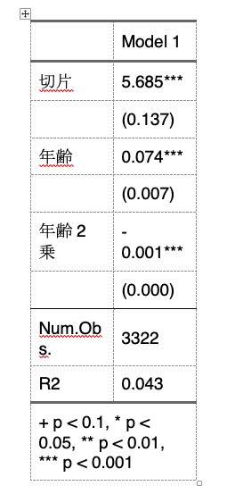

# 回帰分析の基礎 {#regression_basic}

以下の記述はすでに`tidyverse`パッケージを読み込んでおり、また読み込んだデータを`piaac`というデータフレームに入れていることを前提とします。データフレームの名前は`piaac`である必要はありません。以下のようなコードを実行しています。

```{r, eval = FALSE}
library(tidyverse)
```

```{r}
piaac <- read_csv("data/piaac_sample.csv")
```


また、Macで`ggplot2`パッケージを使用し、グラフ中に日本語を使用する場合には、`library(tidyverse)`または`library(ggplot2)`を実行したうえで、たとえば以下のようなコードをあらかじめ実行しておく必要があります。

```{r, eval = FALSE}
theme_set(theme_grey(base_family = "HiraginoSans-W3"))
```

この資料で使用しているグラフについては以下のようにthemeを設定しています。

```{r, eval = FALSE}
theme_set(theme_bw(
  base_family = "HiraginoSans-W3",
  base_size = 11,
  base_rect_size = 0.2,
  base_line_size = 0.2
))
```

Windowsユーザの方は上記コードから`base_family =`の行を除いたこちらのコードで同じような雰囲気になります：

```{r, echo = FALSE}
theme_set(theme_bw(
  base_size = 11,
  base_rect_size = 0.2,
  base_line_size = 0.2
))
```

## 説明

数的思考力スコアが高いほど賃金（時給換算）が高いという傾向があるかどうかを知りたいとする。このとき、年齢を横軸、賃金を縦軸とする散布図を書いてみる。

```{r}
piaac %>% 
  ggplot(aes(x = numeracy, y = wage)) + 
  geom_point(shape = 1)
```

なんとなく、年齢が高いほど賃金が高い傾向があるようにみえる。この関係を1つの直線で要約するとしたらどのようになるだろう？この直線を示したのが次の図になる。

```{r}
piaac %>% 
  ggplot(aes(x = age, y = wage)) + 
  geom_point(shape = 1) + 
  geom_smooth(method = "lm", se = FALSE)
```

このように、従属変数と独立変数の関係を$y = f(x)$というような関数で表現する分析方法を指して、**回帰分析 regression analysis/regression model** という。今回の式の場合は、次のようなかたちになる。とくに今回のような場合を**線形回帰分析 Linear regression**ということもある。

$$
y = \beta_0 + \beta_1x
$$

今の例の場合は、$y$は賃金、$x$は年齢である。$\beta_k$のことを**係数 coefficient** といい、なかでもとくに$\beta_0$のことを**切片 intercept**、$\beta_1$のことを**傾き slope** という。傾きは、$x$が1単位高いときに$y$がどれだけ高いかを表す。

ここで関心があるのは傾きの値である。これが正であれば、$x$が高いほど$y$は高いという正の関係を表すし、負であれば、$x$が高いほど$y$は低いという負の関係を表す。絶対値が大きいほど、$x$ 1単位の変化に対して $y$がより大きく変わるということを表すので、たんに正か負かというだけでなく、その値も重要。

今回の場合は係数はどうなるだろうか？線形回帰分析を推定するときのコマンドが`lm()`である。`lm(data = xx, formula = )`という書き方になる。`formula =`の部分は省略しても大丈夫。

```{r}
lm(data = piaac, formula = wage ~ age)
```

(Intercept)の部分が切片$\beta_0$、ageの部分がageの傾き$\beta_1$にそれぞれ対応する。したがって、賃金と年齢の関係は以下の式のように表されるということを意味する：

```{r, echo = FALSE}
reg_res <- lm(data = piaac, wage ~ age)
reg_res_tidy <- tidy(reg_res) %>% 
  mutate(estimate = round(estimate, digits = 1))
```

$$
y = `r reg_res_tidy$estimate[1]` + `r reg_res_tidy$estimate[2]`x
$$

では、推定された係数というのが偶然ではなく、母集団においても確かに正であるということができるだろうか。そのことを確認するための結果をみるために、いったん、名前をつけて結果を保存する。

```{r}
reg_res <- lm(data = piaac, wage ~ age)
```

名前をつけた結果は、`summary()`でよびだすことができる：

```{r}
summary(reg_res)
```

1列目のEstimateの列には、先ほどみたように係数の値が表示される。2列目のStd. Errorの列が**標準誤差 standard error**を表し、係数のばらつきを示している。4列めのPr(>\|t\|)の列が**p値 p-value**を表している。p値は「もし母集団において係数が0であるという帰無仮説が正しいとしたときに、今回のような係数の値となる確率」を表しており、この値が十分に低いのなら、帰無仮説を棄却して、たしかに母集団においても係数は0でなさそうだ（正あるいは負だ）、ということを自信をもって主張できるということになる。

ageの行のp値を確認すると、`r reg_res_tidy$p.value[2]`となっている。つまり、母集団において年齢の係数が0であったとしたら、今回のような係数の値が得られる確率はとても低い（0.000000000000045）、ということである。

この確率がどれくらい低ければ自信をもって「関係がある」と言えるのかということだが、慣習的には、0.05という基準が使われている。Rでは、0.05よりも小さければ（正確には0.01 ≤ p \< 0.05）、p値の横に`*`という印がつく。同じようにして、0.01よりも小さければ（0.001 ≤ p \< 0.01）`**`、0.001よりも小さければ（p \< 0.001）、`***`という印がつく。

もちろん、上記の回帰式は散布図をみて直観でえいやっと式の値を決めたのではなく、全体の傾向をもっともよく要約するような係数を推定している。その係数の推定方法を**最小二乗法 ordinary least square, OLS**という。

## 独立変数がカテゴリ変数の場合

### 2値のカテゴリ

線形回帰分析では、連続変数だけではなく、カテゴリ変数も扱うことができる。その例としてまず、性別によって賃金がどの程度異なるのかを知りたいとする。このとき、（無理やり）散布図を書くと、次のようになる。分布がわかりやすいように、バイオリン・プロットを重ねて示している。

```{r}
piaac %>% 
  ggplot(aes(x = gender, y = wage)) + 
  geom_violin() + 
  geom_point(shape = 1) 
```

図からわかる通り、男性と比べると女性の賃金が低いことがわかる。平均値を計算して棒グラフにしてみてみよう。

```{r}
piaac %>% 
  group_by(gender) %>% 
  summarize(mean = mean(wage, na.rm = TRUE)) %>% 
  ggplot(aes(x = gender, y = mean)) + 
  geom_col() + 
  geom_text(aes(label = round(mean, digit = 0)), vjust = -1) + 
  ylim(0, 2500)
```

ここで得られた男性の平均値と女性の平均値をそれぞれ散布図に書き入れてみたのが次の図である。実線が男性の平均値、点線が女性の平均値を表している。

```{r}
meandata <- piaac %>% 
  group_by(gender) %>% 
  summarize(mean_wage = mean(wage, na.rm = TRUE)) 

piaac %>% 
  ggplot(aes(x = gender, y = wage)) + 
  geom_violin() + 
  geom_point(shape = 1) +
  geom_hline(yintercept = meandata$mean_wage[1]) + 
  geom_hline(yintercept = meandata$mean_wage[2], lty = 2) 
```

いま、男性であれば1、女性であれば0をとる変数$x$を考えよう。このように、カテゴリ変数のカテゴリを区別するために便宜的に0/1の値を振った変数のことを、**ダミー変数 dummy variable**という。このとき、性別による賃金の違いを表す回帰式は次のようになる：

$$
y = \beta_0 + \beta_1x
$$

回帰式のかたちは先ほどと同じとなる。傾き$\beta_1$は、女性（0）とくらべて男性（1）がどの程度賃金が高いのかを示している。実際、この係数を推定してみよう。

```{r}
piaac <- piaac %>% 
  mutate(male_d = case_when(
    gender == "男性" ~ 1,
    gender == "女性" ~ 0
  ))
piaac %>% 
  select(gender, male_d) %>%
  sample_n(size = 6) # どのような値になっているかをチェック。
```

```{r}
reg_res <- lm(data = piaac, wage ~ male_d)
summary(reg_res)
```

```{r, echo = FALSE}
reg_res_tidy <- tidy(reg_res) %>% 
  mutate(estimate = round(estimate))

```

male_dというのが、性別が男性のときに1、女性のときに0をとる変数である。この係数は傾き$\beta_1$に対応し、切片（Intercept）は切片$\beta_0$に対応する。つまり、推定された式は次のようになる：

$$
y = `r reg_res_tidy$estimate[1]` + `r reg_res_tidy$estimate[2]`x
$$

つまり、女性（x = 0）とくらべて男性（x = 1）の賃金は`r reg_res_tidy$estimate[2]`円高いということを意味している。

この値が、2つのカテゴリ（この場合は男性・女性）、先ほど棒グラフに示した男性の平均値と女性の平均値の差に一致していることを確認しよう。傾きの値は、2つのカテゴリの平均値の差に一致する。

### 3値以上のカテゴリ

カテゴリが3値以上の場合はどうだろう？これも、基本的には同じふうに考えることができる。

```{r}
piaac %>% 
  filter(is.na(educ) == FALSE) %>% 
  ggplot(aes(x = educ, y = wage)) + 
  geom_violin() + 
  geom_point(shape = 1) 
```

中学卒を基準として、高校、短大高専、大学大学院卒だとどれくらい賃金が高いのかを推定することになる。

```{r}
piaac <- piaac %>% 
  mutate(educ_d2 = if_else(educ == "高校", 1, 0)) %>% 
  mutate(educ_d3 = if_else(educ == "短大高専", 1, 0)) %>% 
  mutate(educ_d4 = if_else(educ == "大学大学院", 1, 0)) 

piaac %>% 
  select(educ, educ_d2, educ_d3, educ_d4) %>% 
  sample_n(size = 10) #それぞれどのような値となっているかチェック。
```

```{r}
reg_res <- lm(data = piaac, wage ~ educ_d2 + educ_d3 + educ_d4)
summary(reg_res)
```

それぞれの係数は、基準カテゴリ（今回なら中学卒）と比べて、それぞれどれくらい賃金が高いのかを表している。標準誤差やp値のみかたについてはどれも同じ。

### 変数がfactorであれば自動でカテゴリとして投入される

独立変数の型がカテゴリの場合には、Rが自動で先ほどのようなダミー変数を勝手に作って投入してくれる。

```{r}
reg_res <- lm(data = piaac, wage ~ educ)
summary(reg_res)
```

ただし、基準カテゴリは一番最初（アルファベットが早い順、漢字の場合はよくわからない）のものが勝手に選ばれるので、たとえば高校を基準にしてその他を比較したい、と思ったときには、自分でカテゴリの順序を変更しておく必要がある。

```{r}
piaac <- piaac %>% 
  mutate(educ_reorder = factor(educ,
                               levels = c("高校", "中学", "短大高専", "大学大学院"),
                               labels = c("高校", "中学", "短大高専", "大学大学院")))

reg_res <- lm(data = piaac, wage ~ educ_reorder)
summary(reg_res)
```

## 従属変数が2値のカテゴリ変数（0/1）の場合

### クロス集計と比較しながら結果をみる

たとえば、性別によってこの1年間に職場での訓練（OJTとよぶ）を受ける率が異なっているかどうかを知りたいとする。これも今までと同じように回帰分析の枠組みで扱うことができる。

まず、OJTを受けたならば1、受けていないならば0を取る変数があるとする。この値の平均をとれば、OJTを受けた人の割合に一致する。たとえば以下の2つを比較してみよう。

```{r}
piaac %>% 
  with(table(gender, ojt)) %>% 
  prop.table(margin = 1) %>% 
  round(3)
```

ついで、性別ごとにojtの平均値を計算し、図に書いてみる。

```{r}
piaac %>% 
  group_by(gender) %>% 
  summarize(mean_ojt = mean(ojt, na.rm = TRUE)) %>% 
  ggplot(aes(x = gender, y = mean_ojt, fill = gender)) + 
  geom_col() +
  geom_text(aes(label = round(mean_ojt, digit = 3)), vjust = -1) + 
  ylim(0, 1) + 
  theme(legend.position = "none")
```

```{r, echo = FALSE}
meandata <- piaac %>% 
  group_by(gender) %>% 
  summarize(mean_ojt = mean(ojt, na.rm = TRUE))

```

ここで示された値は、上記クロス表の「1」のほうに示されている行%、すなわち「OJTを受けた人の割合」に一致している。男性は女性とくらべてOJTを受けた割合が`r round((meandata$mean_ojt[2] - meandata$mean_ojt[1])*100, 1)`%ポイント高いということがわかる。

では、回帰式を推定してみよう。

```{r}
reg_res <- lm(data = piaac, ojt ~ gender)
summary(reg_res)
```

「gender男性」と書かれている行が、女性と比べて男性が何ポイントOJTを受ける割合が高いのかを示している。この値が、ちょうど先ほどの棒グラフの男性と女性の割合（平均値）の差に一致していることを確認しよう。係数の見方も、標準誤差も、p値も、すべて今までの回帰分析と同じである。

### 散布図と比較しながら結果をみる

もちろん、年齢などの連続変数を独立変数（X）として使うこともできる。たとえば、横軸に年齢、縦軸にOJTをとった散布図を考えてみよう。ここでは重なっているほど点が大きくなるように調整している。

```{r}
piaac %>% 
  group_by(age, ojt) %>% 
  summarize(n = n()) %>% 
  ggplot(aes(x = age, y = ojt)) + 
  geom_point(aes(size = n), shape = 1) + 
  scale_size(range = c(1, 10)) + 
  geom_smooth(aes(weight = n), method = "lm", se = FALSE) +
  theme(legend.position = "none")
```

縦軸のOJTは0または1しかとらないので、点はy = 1またはy = 0の位置のどちらかに描かれる。推定される回帰式は、この散布図全体の傾向を要約するような線として表される。実際に、回帰式を推定してみよう。

```{r}
reg_res <- lm(data = piaac, ojt ~ age)
summary(reg_res)
```

```{r, echo = FALSE}
reg_res_tidy <- tidy(reg_res) %>% 
  mutate(estimate = round(estimate, digits = 3))
reg_res_tidy$estimate[2]
```

年齢（age）の係数はマイナスであり、年齢が1歳高いと、OJTを受けている割合が`r `reg_res_tidy$estimate[2]`ポイント（`reg_res_tidy$estimate[2] * 100` %ポイント）低いことがわかる。

### 注意点

分析に先立ち、従属変数とする2値のカテゴリ変数のどちらを1とし、どちらを0とするかは自分であらかじめ決めておいて、数値型に変換しておく必要がある（カテゴリ変数のままでは分析できない）。

なお、従属変数が2値のカテゴリ変数の場合にはロジスティック回帰分析がよく使われる。ただし、今紹介した（ふつうの）回帰分析と比べるとやや解釈が難しい。また上記の（ふつうの）回帰分析を使ってもそう間違った結論にはならないので、学部レベルではこれで十分である。もちろん関心のある人は積極的にチャレンジしてみてほしい。くわしくは、[ロジスティック回帰分析](#logit)の章を参照のこと。

### （発展）ロバスト標準誤差

上記のように従属変数が2値の場合の線形回帰分析のことを**線形確率モデル linear probability model**と呼ぶことがある。線形確率モデルの場合は、誤差が正規分布するという仮定に反し、普通の標準誤差は誤った値になってしまうことが知られている。そこで、こうした不均一分散の問題に対処するために、ロバスト標準誤差を用いることが推奨されている。

ここではロバスト標準誤差のことについては説明しないし、授業でも使う必要はないが、推定の仕方だけ書いておく。`estimatr::lm_robust()`で、ロバスト標準誤差を得ることができる。使い方は[このページ](https://keita43a.hatenablog.com/entry/2019/04/17/232548#%E4%B8%8D%E5%9D%87%E4%B8%80%E5%88%86%E6%95%A3%E3%81%A7%E3%81%AE%E5%9B%9E%E5%B8%B0%E5%88%86%E6%9E%90)にくわしい。

```{r, eval = FALSE}
library(estimatr)
```

```{r}
reg_res <- lm_robust(data = piaac, ojt ~ gender)
summary(reg_res)
```

## 非線形の関連

### 対数変換

用いる変数が正規分布から乖離しているときや、変数の単位に依存せず効果の大きさを測定したいときには、変数を対数変換することを検討するとよい。社会科学系では、底がeの対数（自然対数）を取ることで変数を対数変換することが多い。Rでは`log()`という関数で自然対数変換ができる。次のようにして、賃金を対数変換した変数を作ることができる。

```{r}
piaac <- piaac %>% 
  mutate(logwage = log(wage))
```

2つの変数の分布を比較してみよう。

```{r}
piaac %>% 
  ggplot(aes(x = wage)) + 
  geom_histogram()

piaac %>% 
  ggplot(aes(x = logwage)) + 
  geom_histogram()
```

対数変換した後の変数は、対数変換する前の変数よりも正規分布に近づいていることがわかる。

#### 自然対数と対数関数について

$$
e = \lim_{t\rightarrow0}(1 + t)^{\frac{1}{t}} \simeq 2.7182818\cdots
$$ で定義される数のことを**ネイピア数**といい、$e$と書く（円周率$\pi$みたいな感じ）。慣習上、ネイピア数$e$を底とする指数$e^x$を$\exp(x)$と表記したりする。

$\log_a x$のように表される関数を**対数関数**といい、次のように定義される： $$
a^y = x \leftrightarrow y = \log_a x
$$

とくに底が$e$の場合を**自然対数**という。社会科学系の文脈ではこのときには底を省略して、$e^y = x \leftrightarrow y = \log(x)$というふうに書かれることが多い。

#### 対数を使った場合の回帰分析

先にみたように、対数賃金と年齢との散布図を書くと、次のようになる。

```{r}
piaac %>% 
  ggplot(aes(x = age, y = logwage)) + 
  geom_point(shape = 1) + 
  geom_smooth(method = "lm", se = FALSE)
```

対数変換した後の賃金を従属変数として、回帰分析を推定してみよう。

```{r}
reg_res <- lm(data = piaac, logwage ~ age)
summary(reg_res)
```

なお、対数変換した変数を新たに作成しなくても、次のように書くことで、回帰分析のコード中で対数変換を行う事ができる。以下でも同じ結果を得ることができる（結果は省略）。

```{r, results="hide"}
lm(data = piaac, log(wage) ~ age)
```

```{r, echo = FALSE}
reg_res <- lm(data = piaac, logwage ~ age)
reg_res_tidy <- tidy(reg_res) %>% 
  mutate(estimate = round(estimate, digits = 3))

reg_res_tidy$estimate[2]
```

年齢の係数は、年齢が1歳高いと、対数賃金が`r reg_res_tidy$estimate[2]`ポイント高いということを意味する。対数をとった場合、（微小な）変化は%の変化に一致する（後述）。すなわち、年齢が1歳高いと、賃金が0.4%高い（10歳高いと、4%高い）ということを意味している。

#### 対数を使った場合の回帰分析：なぜ%になるのか

以下のような単回帰分析について考える。

$$
y = \beta_0 + \beta_1x
$$

このとき、$x$を1単位増やしたときの$y$の変化分を$\Delta y$と表すことにする。すると

$$
\begin{align}
y + \Delta y &= \beta_0 + \beta_1 (x + 1) \\
y + \Delta y &= (\beta_0 + \beta_1 x) + \beta_1 \\
\Delta y &= \beta_1 \\
\end{align}
$$

$\Delta y = \beta_1$となる。すなわち、$\beta_1$は、$x$を1単位増やしたときに$y$がどれだけ増えるかに一致する。

では、次のような式のときはどうだろうか？

$$
\log(y) = \beta_0 + \beta_1x
$$

同じように、$x$が1単位増えたときの$y$の変化分を$\Delta y$と表すことにする。すると、

$$
\begin{aligned}
\log(y + \Delta y)
&= \beta_0 + \beta_1(x + 1) \\
y + \Delta y &= \exp(\beta_0 + \beta_1x + \beta_1) \\
y + \Delta y &= \exp(\beta_1)\exp(\beta_0 + \beta_1x) \\
y + \Delta y &= \exp(\beta_1)y \\
\Delta y &= (\exp(\beta_1) - 1)y 
\end{aligned}
$$

となり、xが1単位増えたときに$y$は$(\exp(\beta_1) - 1)$倍ぶんだけ増える、ということがわかる。実際の値を計算してみると、次のようになる：

$$
\begin{align}
\beta_1 &= 0.1 \leftrightarrow \exp(\beta_1) - 1 \simeq 0.11 \\
\beta_1 &= 0 \leftrightarrow \exp(\beta_1) - 1 \simeq 0 \\
\beta_1 &= -0.1 \leftrightarrow \exp(\beta_1) - 1\simeq -0.10 \\
\end{align}
$$

$\beta_1$が0に近い値ならば、おおむね「$x$が1単位高いと、$y$が$100 \times \beta_1$%高い」といえる。

ただし、係数の絶対値が大きくなるほど$\beta_1$と$\exp(\beta_1) - 1$のずれが大きくなるという点は頭の片隅に入れておくとよい。図にするとこんな感じで、0から離れるほど点線からずれていく：

```{r, eval = FALSE, echo = FALSE}
b1 <- seq(-1, 1, length = 501)
tibble(b1) %>% 
  mutate(linear = b1) %>% 
  mutate(exp = exp(b1) - 1) %>% 
  pivot_longer(col = -b1) %>% 
  ggplot(aes(x = b1, y = value, linetype = name)) +
  geom_line() + 
  labs(x = "β", y = "exp(β) - 1") + 
  theme(legend.position = "none")
```

#### 対数をとった場合の結果の解釈

従属変数だけではなく、独立変数についても対数を取ることができる。その場合の解釈はそれぞれ次のようになる：

| 従属変数  | 独立変数  | 解釈                                             |
|-----------|-----------|--------------------------------------------------|
| $y$       | $x$       | $x$が1単位高いと、$y$が$b_1$高い                 |
| $\log(y)$ | $x$       | $x$が1単位高いと、$y$が$100 \times \beta_1$%高い |
| $y$       | $\log(x)$ | $x$が1%高いと、$y$が$\beta_1 / 100$高い          |
| $\log(y)$ | $\log(x)$ | $x$が1%高いと、$y$が$\beta_1$%高い               |

### 2次関数型

年齢と賃金の関係は、たんに年齢が上がると賃金が上がるという線形の関連ではなく、年齢が上がるほど賃金の上昇が緩やかになっていって、ある程度年齢が上がると関係が反転する（負の関係になる）ということが考えられる。2次関数を使うことで、こうした関係をうまく表現できる。

$$
y = \beta_0 + \beta_1x + \beta_2x^2
$$

#### 係数の読み方

このような場合、$x$が1単位増加したときの$y$の増加量は、もともとの$x$の値によって異なる。$x$が1単位増えたときの$y$の変化分を$\Delta y$と表すとすると、

$$
\begin{align}
y + \Delta y &= \beta_0 + \beta_1(x + 1) + \beta_2 (x + 1)^2 \\
&= (\beta_0 + \beta_1x + \beta_2x^2) + \beta_1 + (2x + 1)\beta_2 \\
\Delta y &= \beta_1 + (2x + 1)\beta_2
\end{align}
$$

となる。すなわち、$x$が1単位増加したときの$y$の増加量は、もともとの$x$の値によって異なるということになる。回帰式の形状や結果の読み方は次のようになる：

| $\beta_2$の係数 | 解釈                                                 | 形状                                           |
|-----------------|------------------------------------------------------|------------------------------------------------|
| $\beta_2 < 0$   | xが大きいほど、x1単位の増加に対するyの増加量は小さい | $-\beta_1/2\beta_2$を底とする、上に凸な2次関数 |
| $\beta_2 > 0$   | xが大きいほど、x1単位の増加に対するyの増加量は大きい | $-\beta_1/2\beta_2$を底とする、下に凸な2次関数 |

#### 変数の作成と結果の解釈

年齢を2乗した変数は次のように作成できる。

```{r}
piaac <- piaac %>% 
  mutate(age_sq = age^2)
```

回帰分析を行ってみる：

```{r}
reg_res <- lm(data = piaac, logwage ~ age + age_sq)
summary(reg_res)
```

二次曲線の場合、個々の係数だけではあまり解釈ができない。そこで、散布図と回帰直線（曲線）をみてみよう：

```{r}
piaac %>% 
  ggplot(aes(x = age, y = logwage)) + 
  geom_point(shape = 1) + 
  geom_smooth(method = "lm", formula = y ~ poly(x, 2), se = FALSE)
```

このように、若いときには年齢による賃金の上昇は大きいけれども、その上昇幅は年齢が高くなるほど小さくなり、高い年齢ではむしろ負に転ずることがわかる。年齢についてはこのように二次曲線をつかうことはしばしば有効だ。

なお2乗した変数を別に作らなくても、回帰分析のコード中で2乗した変数を作成することができる。（結果は省略）

```{r, results='hide'}
lm(data = piaac, log(wage) ~ age + I(age^2))
```

## 結果の出力

### modelsummary(): 結果をきれいに表示する

先ほどの回帰分析の結果をもう少しきれいに表示したいと思うかもしれない。このようなときに活躍するのが`modelsummary`パッケージである。

```{r, eval = FALSE}
library(modelsummary)
```

では、実際に使ってみよう。`modelsummary(list(model))`（modelという部分には、すでに保存しておいた回帰分析の結果を入れる）というのが最低限のコマンド。

```{r}
reg_res <- lm(data = piaac, log(wage) ~ age + I(age^2))

modelsummary(list(reg_res)) 
```

よく論文でみる感じのきれいな見た目になる。とはいえ、まだたとえば変数名が何を指しているかなどは改善の余地がある。オプションを色々指定することで、よりわかりやすい表が作れる。

```{r}
modelsummary(list(reg_res),
         stars = TRUE, # 有意水準を示す印をつける
         coef_rename = c("(Intercept)" = "切片",
                         "age" = "年齢",
                         "I(age^2)" = "年齢2乗"), # 各変数に名前をつける
         gof_omit = "R2 Adj.|AIC|BIC|Log.Lik.|F") # 不要な統計量を削除する

```

このように各変数がそれぞれ何の変数なのか名前をつけてやると、読む人にとって見やすい表になる。

### Wordに分析結果を書き出す

レポートをWordで執筆している場合には、上記の結果をwordなどのファイルに貼り付けたりしたいと思うだろう。このようなときにも`modelsummary()`は活躍する。上記のコードに`output = "xxx.docx"`というようなオプションをつけることで、wordファイルに結果を書き出すことができる。

```{r, eval = FALSE}
modelsummary(list(reg_res),
         stars = TRUE, # 有意水準を示す印をつける
         coef_rename = c("(Intercept)" = "切片",
                         "age" = "年齢",
                         "I(age^2)" = "年齢2乗"), # 各変数に名前をつける
         gof_omit = "R2 Adj.|AIC|BIC|Log.Lik.|F", # 不要な統計量を削除する
         output = "regression_result.docx") # 出力先のファイル名をつける
```

実際の出力結果は以下のようになる。これをコピーして多少手直しすれば、きれいな回帰分析の表をWordに載せることができる。


