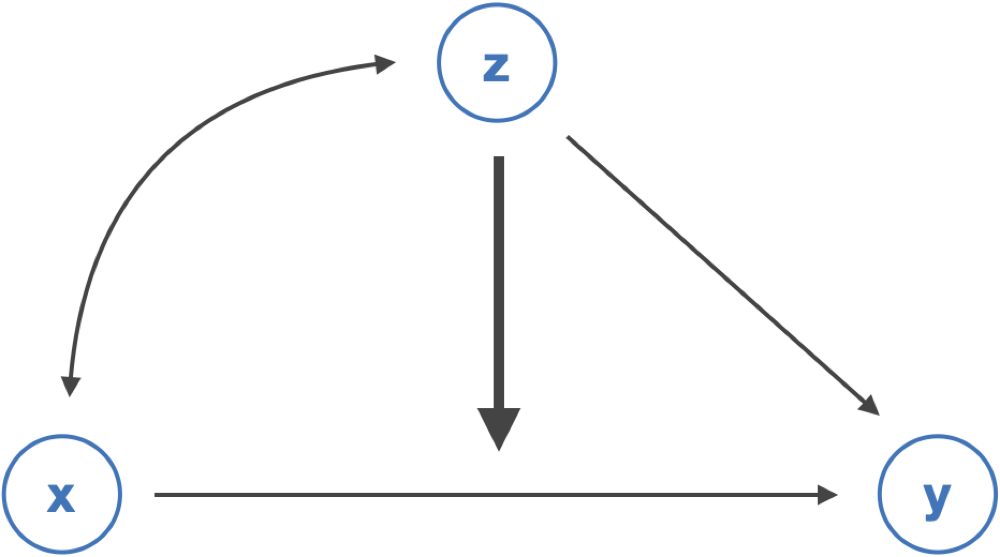

# 交互作用 {#regression_interaction}

本章では、前章で学んだ回帰分析において、独立変数の効果が他の独立変数によって異なるかどうか（**交互作用**）を検証するための方法について説明する。

内容に入る前に、右上のプロジェクトのボックスの横が、前章で作成したプロジェクトの名前（たとえば、seminar_sociology_r）になっているかどうかを確認しておこう。なっていない場合は、右上のボックスをクリックして、「Open Project...」を選択し、前章で作成したRprojファイル（たとえば、seminar_sociology_r.Rprojといったような名前になっている）を選んで、プロジェクトを切り替えよう。

さらに、これまでの章で説明した以下のパッケージを読み込んだ上で、[第4章](#handling)で作成したデータを読み込んで`piaac`というデータフレームに入れていることを前提とする。具体的には、以下のコードを実行しておく必要がある。

```{r}
library(tidyverse)
library(gtsummary)
library(flextable)
library(modelsummary)

piaac <- read_rds("data/piaac_sample_analytic.rds")
```

[第5章で確認したように](#descriptives_ggplot)、ggplotの設定を変更しておくことで見やすいグラフを作ることができる。ここでは以下のコードを実行している。

Macの場合：

```{r}
theme_set(theme_bw(
  base_family = "HiraginoSans-W3",
  base_size = 11,
  base_rect_size = 0.2,
  base_line_size = 0.2
))
```

Windowsの場合：

```{r, eval = FALSE}
theme_set(theme_bw(
  base_size = 11,
  base_rect_size = 0.2,
  base_line_size = 0.2
))
```

## 交互作用とはなにか

ある独立変数が従属変数に与える効果が別の変数によって異なることを指して、**交互作用（interaction）**がある、または**調整効果（moderation effect）**があるという。例えば以下のような例がある。

-   子どもを出産すると、女性の賃金は下がる一方で、男性の賃金は下がらないかむしろ上がる（出産が賃金に与える効果が性別によって異なる）[^09-interaction-1]。
-   出身階層が高いほど高い学歴を得やすいという傾向は、近年の世代（コーホート）ほど弱い（出身階層が教育達成に与える効果がコーホートによって異なる）[^09-interaction-2]。
-   出身階層が到達階層に与える効果は、非大卒層よりも大卒層においてより大きい（出身階層が到達階層に与える効果が学歴によって異なる）[^09-interaction-3]。
-   州が公的支出を行うと、高所得層の子どもに対する支出額は変わらないが、低所得層の子どもに対する支出額は増加する（公的投資が子どもに対する支出に与える効果が親所得によって異なる）[^09-interaction-4]。

[^09-interaction-1]: 出産すると女性の賃金が下がることは母親ペナルティと呼ばれ、他方男性の賃金は上がることは父親ペナルティと呼ばれそれぞれ研究がなされている。近年の研究としては例えば Yu, W.-H., & Hara, Y. (2021). Motherhood Penalties and Fatherhood Premiums: Effects of Parenthood on Earnings Growth Within and Across Firms. *Demography*, *58*(1), 247--272. ただし父親ペナルティについては見せかけの関連（賃金が高くなりやすい男性ほど子どもを持ちやすい）なのではないかという指摘がある。たとえば Killewald, A., & Lundberg, I. (2017). New Evidence Against a Causal Marriage Wage Premium. *Demography*, *54*, 1007--1028. など。

[^09-interaction-2]: 出身階層（親の階級や学歴）が高いほど子の教育達成が高いという傾向は20世紀の間で大きく変化していない（"persistent inequality"）を主張したShavit & Blossfeld (1993)に対して、西ヨーロッパ8カ国の統合的なデータを使った比較研究を行ったBreenら（2009）は、出身階層（親の階級）が子どもの教育達成に与える影響は近年のコーホートほど弱まっている（"nonpersistent inequality"）と主張した。

    Shavit, Y., & Blossfeld, H.-P. (1993). *Persistent inequality: Changing educational attainment in thirteen countries*. Westview Press.

    Breen, R., Luijkx, R., Müller, W., & Pollak, R. (2009). Nonpersistent inequality in educational attainment : Evidence from eight European countries. *American Journal of Sociology*, *114*(5), 1475--1521.

[^09-interaction-3]: Torche（2011）は階級、社会経済的地位指標、所得、賃金などさまざまな階層を表す指標を用いて親と子の相関を子どもの学歴別に検討した。その結果、いずれについても、子どもが大卒であると、そうでない場合と比較して親と子の階層指標の相関が弱くなることを発見した。ただしこれも近年の研究では必ずしも成り立たないのではないかと指摘されている（e.g. Zhou 2019）。

    Torche, F. (2011). Is a College Degree Still the Great Equalizer? Intergenerational Mobility across Levels of Schooling in the United States. *American Journal of Sociology*, *117*(3), 763--807.

    Zhou, X. (2019). Equalization or Selection? Reassessing the "Meritocratic Power" of a College Degree in Intergenerational Income Mobility. *American Sociological Review*, *84*(3), 459--485.

[^09-interaction-4]: Jackson, M. I., & Schneider, D. (2022). Public Investments and Class Gaps in Parents' Developmental Expenditures. *American Sociological Review*, *87*(1), 105--142.

いずれも、ある独立変数（xとする）の効果が、別の変数（zとする）の値によって異なるということである。これを図にして表すと、次のようになる。



こうした交互作用効果は回帰分析の枠組みで検証することができる。具体的には、次のような回帰式を推定する。

$$
y = \beta_0 + \beta_1x + \beta_2z + \beta_3xz
$$

$\beta_3$が、$z$の水準によって$x$の効果がどの程度変化するのかを表す係数である。この式を次のように変形してみよう。

$$
y = \beta_0 + (\beta_1 + \beta_3z)x + \beta_2z
$$

このように書くと、$\beta_3$はzの値に応じて$x$の効果を強めたり弱めたりする「スイッチ」のような役割を果たす係数であることがわかる。

それぞれ、$\beta_1$の正負と$\beta_3$の正負によって次のように解釈が変わる。

|                              | $\beta_3 > 0$（zの係数が正）           | $\beta_3 < 0$（zの係数が負）           |
|--------------------|--------------------------|--------------------------|
| $\beta_1 > 0$（xの係数が正） | zが大きいほど、xの正の効果は大きくなる | zが大きいほど、xの正の効果は小さくなる |
| $\beta_1 < 0$（xの係数が負） | zが大きいほど、xの負の効果は小さくなる | zが大きいほど、xの負の効果は大きくなる |

## xが連続変数、zがカテゴリ変数（またはその逆）の場合

zがカテゴリ変数（0、1の2値をとるものとする）の場合について考えてみよう。交互作用を含めた場合の回帰式は以下のようになる。

$$
\begin{align}
y
&= \beta_0 + \beta_1x + \beta_2z + \beta_3xz \\
&= \beta_0 + (\beta_1 + \beta_3z)x + \beta_2z
\end{align}
$$

$z$が0か1かの値を取るカテゴリ変数の場合には、次のような解釈ができる。

-   $z = 0$のとき：$x$が1単位高いと、$y$は$\beta_1$高い。
-   $z = 1$のとき：$x$が1単位高いと、$y$は$\beta_1 + \beta_3$高い。

例えば、$\beta_1 > 0$、$\beta_3 > 0$のときは、次のような図になる。$z = 1$の場合には、$\beta_3$分だけ、正の傾きがより大きくなることになる。

```{r, include=FALSE}
z <- c(0, 0, 1, 1)
x <- c(1, 2, 1, 2)
y <- c(1, 2, 2, 6)
tibble(y, x, z) %>%
  mutate(z = factor(z, 
                    levels = 0:1,
                    labels = c("z = 0: y = b0 + b1x",
                               "z = 0: y = b0 + (b1 + b3)x + b2"))) %>% 
  ggplot(aes(x = x, y = y, 
             group = z, color = factor(z),
             shape = factor(z))) + 
  geom_line() + 
  geom_point() + 
  scale_shape_manual(values = c(1, 16)) + 
  theme(panel.grid = element_blank(),
        legend.position = c(0.3, 0.9),
        legend.background = element_blank(),
        axis.text = element_blank(),
        axis.ticks = element_blank()) +
  labs(color = "", shape = "")
```

交互作用を表す変数$xz$を含めた場合には、$\beta_1$および$\beta_2$はそれだけでは解釈できない値になることに注意が必要である。$\beta_1$は、$z = 0$のときの$x$の効果（$x$が1単位高いときに$y$がどれだけ高いか）を表し、$\beta_2$は$x = 0$のときの$z$の効果（$z$が1単位高いときに$y$がどれだけ高いか）を表す。交互作用を含めた場合には、交互作用を表す係数$\beta_3$のみに注目して結果を解釈するとよい。

### 実例：数的思考力が賃金を高める効果は性別によって異なるか？

男性は数学が得意だとより数学的な思考力を必要とする賃金の高い仕事に就く一方で、女性の場合には数学が得意だとしてもそうした傾向は見られないということがあるかもしれない。つまり、数的思考力が賃金を高める効果は、女性よりも男性においてより大きいかもしれない。これはまさに交互作用に関する仮説である。

この仮説を検証するための式は次のように書くことができる。

$$
\begin{align}
y 
&= \beta_0 + \beta_1数的思考力 + \beta_2男性 + \beta_3数的思考力\times 男性
\\
&= \beta_0 + (\beta_1 + \beta_3男性)数的思考力 + \beta_2男性 
\end{align}
$$

先の仮説が正しければ、数的思考力と性別の交互作用項の係数$\beta_3$は正の値になるはずである。

Rでは、交互作用を含めたい変数どうしを`*`でつなぐことで、かけ算をした項を独立変数に含める事ができる。例えば次のように。

```{r}
reg_res <- lm(data = piaac, logwage ~ numeracy + gender + numeracy * gender) # *で変数どうしのかけ算を表す
summary(reg_res)
```

```{r, include=FALSE}
reg_res_tidy <- reg_res %>% tidy()
reg_res_tidy$estimate[4] %>% round(digits = 5)
```

`numeracy:gender男性`と表示されている箇所が交互作用項$xz$の係数である。確かに係数は正であり、男性であると、数的思考力が高くなると賃金が高くなるという傾向がより強いことがわかる（男性であると、数的思考力が1単位高い場合に、`r reg_res_tidy$estimate[4] %>% round(digits = 5)`だけ女性よりも大きく賃金が上昇する）。しかしながら`Pr(>|t|)`の列をみると0.05を上回っており、係数は統計的に有意であるとはいえない。したがって、先の仮説は成り立つとはいえない。

先に述べた通り、交互作用項を含めた場合には$x$と$z$の係数そのものを解釈することはできなくなる。そこで、交互作用を検討したい場合には、まず交互作用を含まないモデルを提示し、そのあと交互作用を含むモデルを提示するとわかりやすいだろう。

もちろん、これまでの重回帰分析に関する説明同様、統制変数を含めることもできる。統制変数を含めたモデルを推定して、結果を提示する場合の例は次のとおりである。

```{r}
reg_res1 <- lm(data = piaac, logwage ~ numeracy + gender + age + I(age^2) + educ)
reg_res2 <- lm(data = piaac, logwage ~ numeracy + gender + numeracy * gender + age + I(age^2) + educ)

modelsummary(list(reg_res1, reg_res2),
         stars = TRUE, 
         fmt = 4,
         coef_map = c("numeracy" = "数的思考力スコア",
                      "gender男性" = "男性",
                      "numeracy:gender男性" = "数的思考力スコア x 男性",
                      "age" = "年齢",
                      "I(age^2)" = "年齢2乗",
                      "educ高校" = "高校（ref: 中学）",
                      "educ短大高専" = "短大高専（ref: 中学）",
                      "educ大学大学院" = "大学大学院（ref: 中学）",
                      "(Intercept)" = "切片"), 
         gof_map = c("nobs", "r.squared"))
```

この例のように、関心のある変数（今回の場合は交互作用項とそれに関係する変数）を上のほうに表示すると結果が見やすくてよい。

### 結果を図示する

たんに表の数式だけではなく、実際にどの程度の効果の大きさなのかを視覚的に調べることが重要である。このような用途の最適なのが、`ggeffects`パッケージ（→[説明](https://strengejacke.github.io/ggeffects/)）である。また、`ggeffects`パッケージに含まれている関数の一つで別の`effects`というパッケージも必要となるので、併せてインストールしておく。まずはパッケージをインストールしよう。

```{r, eval = FALSE}
install.packages("ggeffects")
install.packages("effects")
```

`library()`で読み込んでおく。これは、`ggeffects`だけでよい。

```{r}
library(ggeffects)
```

使い方はつぎのとおり。交互作用効果を図示したい回帰式を指定し、`ggpredict(結果が入った回帰式, c("xになる変数", "zになる変数"）`とすることで、予測値や95%信頼区間を求めることができる。このデータフレームを何らかの名前をつけたオブジェクトに入れる。保存したオブジェクトに対して`plot()`を実行することで、先に見たような交互作用の図を出力することができる。

```{r}
predicted <- ggeffect(reg_res2, c("numeracy", "gender")) # 予測値を求めて結果を保存

predicted %>% plot() # 結果をプロット
```

また、`ggpredict()`で保存したデータフレームは`ggplot()`で図を作成するときと同じようにオプションを付けてより見やすい図を作ることもできる。編集の一例を以下に示す。

```{r}
predicted %>% 
  plot() + 
  labs(x = "数的思考力スコア", y = "対数賃金", color = "", title = "") +
  theme(panel.grid.minor = element_blank()) + 
  theme_bw(base_family = "HiraKakuProN-W3") # Macの場合はこれをつけないと文字化けするかもしれない
```

### xがカテゴリ変数、zが連続変数の場合

先ほどは、「数的思考力スコア（x）が賃金を高める効果は女性よりも男性において（z）より大きい」という仮説を立てた。これのxとzを入れ替えて、「男性であることが賃金を高める効果は数的思考力スコアが高いほどより大きい」という仮説も立てることができる。

この場合、先とまったく同じ回帰式を用いることができる。つまり、

$$
\begin{align}
y 
&= \beta_0 + \beta_1数的思考力 + \beta_2男性 + \beta_3数的思考力\times 男性
\\
&= \beta_0 + (\beta_2 + \beta_3数的思考力)男性 + \beta_1数的思考力 
\end{align}
$$

数的思考力が1ポイント高いと、男性であることが賃金を高める効果は$\beta_3$だけ大きくなるということを意味する。式がまったく同じなので、Rのコードもまったくおなじで構わない。

```{r}
reg_res <- lm(data = piaac, logwage ~ numeracy + gender + numeracy * gender) # *で変数どうしのかけ算を表す
```

結果は省略する。

## xがカテゴリ変数、zがカテゴリ変数の場合

次に、xもzもカテゴリ変数の場合を考えてみよう。学歴が高いほど賃金も高い傾向があるのは先にみたとおりだが、その効果は性別によって異なるかもしれない。たとえば、学歴が賃金を高める効果は、男性よりも女性のほうが大きいのではないか、という仮説を立てることができる。学歴（x）の効果が、性別（z）によって異なるのではないか？ということである。この場合の式は次のようになる。

$$
y = \beta_0 + \beta_1学歴 + \beta_2女性 + \beta_3学歴\times 女性
$$

上式で、$\beta_3 > 0$となれば、仮説が支持されたといえる。今回は学歴を中学、高校、短大高専、大学大学院、という4カテゴリの変数で測定しているので、例えば中学を参照カテゴリとした場合には、次のような式となる。

$$
\begin{align}
y =& \beta_0 + \beta_{1,1}高校 + \beta_{1,2}高専短大 + \beta_{1,3}大学大学院 + \beta_2女性 + \\
&\beta_{3,1}高校\times 女性 + \beta_{3,2}高専短大\times 女性 + \beta_{3,3}大学大学院\times 女性 \\
=&\beta_0 + (\beta_{1,1} + \beta_{3,1}女性)高校 + (\beta_{1,2} + \beta_{3,2}女性)高専短大 + (\beta_{1,3} + \beta_{3,3}女性)大学大学院 + \beta_2女性
\end{align}
$$ - $\beta_{3,1}$は、男性が中学卒→高校卒になったときに上昇する賃金と比べて、女性が中卒→高卒となったときに上昇する賃金は$\beta_{3,1}$だけ高いということを意味する。 - $\beta_{3,2}$は、男性が中学卒→高専短大卒になったときに上昇する賃金と比べて、女性が中卒→高専短大卒となったときに上昇する賃金は$\beta_{3,2}$だけ高いということを意味する。 - $\beta_{3,3}$は、男性が中学卒→大学大学院卒になったときに上昇する賃金と比べて、女性が中卒→大学大学院卒となったときに上昇する賃金は$\beta_{3,3}$だけ高いということを意味する。

交互作用を含める場合のコードは先ほどと同じである。

```{r}
# 男性が先、女性が後の順になる変数を作成する
piaac <- piaac %>% 
  mutate(gender_rev = fct_relevel(gender, "男性", "女性"))

reg_res3 <- lm(data = piaac, logwage ~ educ + gender_rev + age + I(age^2))
reg_res4 <- lm(data = piaac, logwage ~ educ + gender_rev + educ*gender_rev + age + I(age^2))
```

```{r}
modelsummary(list(reg_res3, reg_res4),
             stars = TRUE,
             coef_map = c("educ高校" = "高校（ref: 中学）",
                          "educ短大高専" = "短大高専（ref: 中学）",
                          "educ大学大学院" = "大学大学院（ref: 中学）",
                          "gender_rev女性" = "女性",
                          "educ高校:gender_rev女性" = "女性 x 高校",
                          "educ短大高専:gender_rev女性" = "女性 x 短大高専",
                          "educ大学大学院:gender_rev女性" = "女性 x 大学大学院",
                          "age" = "年齢",
                          "I(age^2)" = "年齢2乗",
                          "(Intercept)" = "切片"),
             gof_map = c("nobs", "r.squared"))
```

女性×短大高専、女性×大学大学院の係数は正の値であり、10%水準ではあるものの、正の値である。すなわち、女性が高い学歴を持っている場合の賃金の上昇は、男性が高い学歴を持っている場合の賃金の上昇と比べて大きいといえる。

視覚的にはどのように表現できるだろうか。先に用いた`ggeffects::ggeffect()`を使って結果を図示してみよう。

```{r}
predicted <- ggeffect(reg_res4, terms = c("educ", "gender_rev")) # 予測値を求めて結果を保存

predicted %>% 
  plot() +
  theme_bw(base_family = "HiraKakuProN-W3") +  # Macの場合はこれをつけないと文字化けするかもしれない
  theme(panel.grid.minor = element_blank()) + 
  labs(x = "学歴", y = "対数賃金", color = "") 
```

学歴が高いと賃金が高くなる傾向は男女とも共通であるが、女性は男性と比べて学歴が高くなるとより大きく賃金が高くなることが視覚的にわかりやすい。

# xが連続変数、zが連続変数の場合（作成中）
